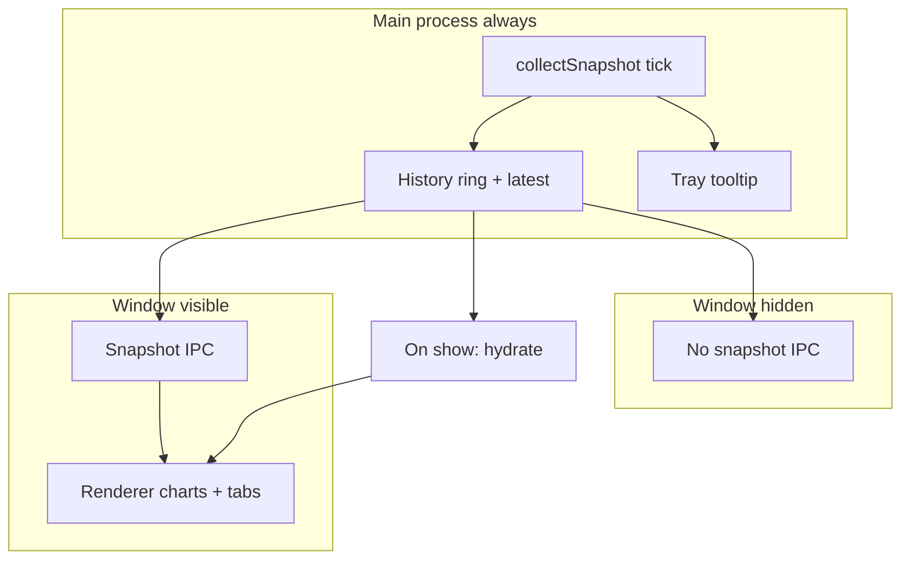

# Tray-only performance (memory / CPU)

## Product constraints (your requirements)

- **Do not lose RAM chart continuity**: Overview RAM history uses `history[].ramUsedPct` (`[Overview.tsx](src/renderer/tabs/Overview.tsx)`); that series must keep accumulating while the window is hidden, not go flat or reset.
- **Do not lose storage / memory display**: Memory breakdown and drive list come from the **latest** `SensorSnapshot` (`[Overview.tsx](src/renderer/tabs/Overview.tsx)` — `s.memory`, `s.storage.drives`). After tray-only time, reopening must show **current** values via the latest snapshot, not a stale renderer-only cache.
- **Chromium / React work is unnecessary while tray-only**: No per-second UI reconciliation, Recharts updates, or Zustand `ingest` traffic when the user cannot see the window.

These constraints rule out “destroy the window and accept empty charts” **unless** we first implement **main-process ownership** of history + latest snapshot and **hydrate** the renderer when the UI comes back (then destroying Chromium is optional and safe for data).

## What runs today

- `[src/main/index.ts](src/main/index.ts)`: every second, `collectSnapshot()`, tray tooltip, disk log, and `**webContents.send`** to the renderer — **even when hidden**.
- Hidden window still loads full Chromium + React; `[ingest](src/renderer/store.ts)` runs ~1 Hz.

You **cannot** remove the Electron **main** process while using Electron’s `Tray`. Shedding **Chromium** is done by not driving the renderer (Tier A/B) and optionally destroying `BrowserWindow` **after** hydration exists (Tier C).

## Architecture: main-owned history + gated renderer IPC

**Single idea**: The main process already computes a full `SensorSnapshot` every tick. Import `[deriveHistoryPoint](src/shared/history.ts)` in main and maintain a **ring buffer of `HistoryPoint`** (same cap semantics as today’s Zustand buffer: driven by `historyRetentionMinutes` / samples-per-minute). Keep `**latest` snapshot** reference on each tick for hydrate.

| Window state  | Main process                                                   | Renderer                                                                                                                                                                                            |
| ------------- | -------------------------------------------------------------- | --------------------------------------------------------------------------------------------------------------------------------------------------------------------------------------------------- |
| Visible       | Poll; append ring; **send** snapshot IPC as today              | Live updates                                                                                                                                                                                        |
| Hidden (tray) | Poll; append ring; tray tooltip; disk log; **no snapshot IPC** | Idle (no chart/React churn)                                                                                                                                                                         |
| Shown again   | Poll                                                           | One `**hydrate`** IPC: `{ history, latest }` → replace or merge into `[useSensorTray](src/renderer/store.ts)` so RAM history includes the hidden interval and memory/storage stats match **latest** |

**Renderer changes**: Add something like `applyHydrate({ latest, history })` or bulk `ingest` sequence so reopening does not wipe the hidden-period samples. Preload exposes `onHydrate` or reuse a one-shot invoke after `show`.

**Duplication note**: While visible, both main ring and renderer ingest may compute the same points; acceptable for clarity. Alternatively, main-only ring + visible path only pushes snapshot for non-chart tabs — can be a follow-up simplification.

## Tier A — Gated IPC + hydrate (required for your goals)

- In `tick()`, **do not** `send(IPC_CHANNEL_SNAPSHOT)` when `!mainWindow.isVisible()` (define behavior for minimized vs tray-hidden if needed).
- **Always** append to main ring + store `latestSnapshot` each tick (when tray-only, this preserves RAM chart data).
- On `**show`** / `**restore**`: send hydrate payload so **RAM % history** and **latest memory/storage** fields are correct.

## Tier B — Cheaper main process while UI hidden (optional)

- Slower poll interval when hidden (e.g. 2–5 s): **tradeoff** — tray tooltip and disk log granularity coarsen; RAM chart time resolution in the hidden interval coarsens. Expose as a setting if you add this.

## Tier C — Destroy `BrowserWindow` when tray-only (optional, after A)

- **Only after** hydrate is reliable: replace `hide` with `destroy` behind a setting (“Unload UI in tray”) to drop Chromium memory.
- Recreate window on Show / second-instance; first paint calls hydrate from main ring + latest snapshot — **no loss** of RAM series or storage/memory display vs Tier A.
- Updater (`[src/main/updater.ts](src/main/updater.ts)`) already works without a focused window.

## Out of scope / not promised

- Removing the Electron main process entirely while keeping this codebase’s tray — would be a different app (external tray helper + IPC).

## Suggested implementation order

1. **Main history ring + latest snapshot** in `[src/main/index.ts](src/main/index.ts)` (or small `src/main/historyRing.ts` module).
2. **Visibility-gated IPC** + `**show` hydrate** + renderer `**applyHydrate`** + preload wiring.
3. Tier B if CPU is still high when hidden.
4. Tier C if RAM from Chromium remains a problem **after** 1–2.

