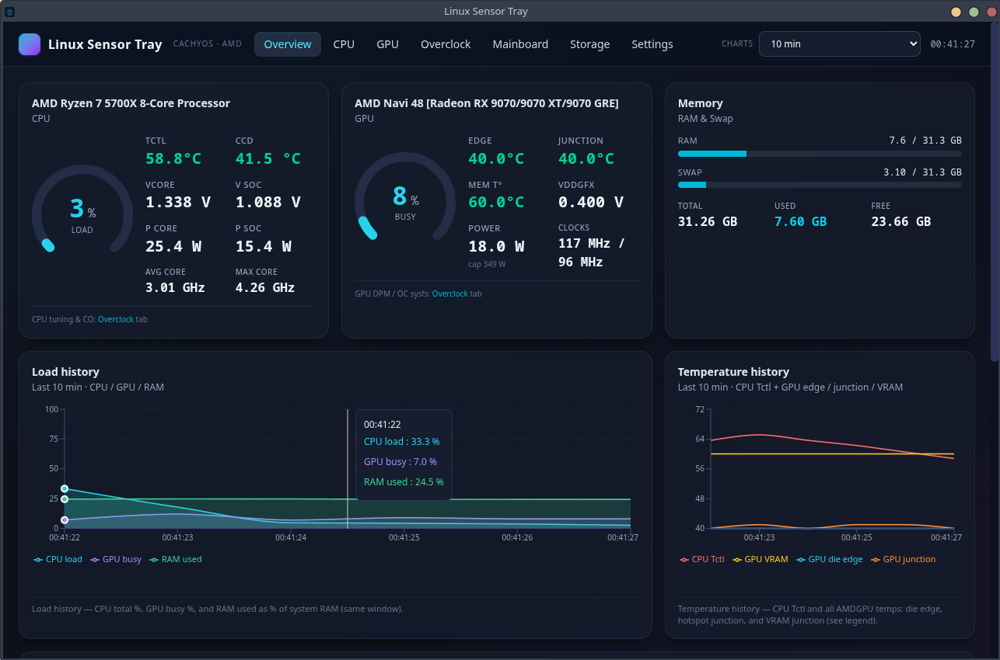

# Linux Sensor Tray

Tray-first Electron app for live CPU, GPU, mainboard, storage, and memory stats on Linux. Reads sensors directly from `/sys/class/hwmon` and `/proc` — **no daemon** and **no `sudo` for normal use**.

- **Repository**: [github.com/Mindsaver/linux-sensor-tray](https://github.com/Mindsaver/linux-sensor-tray)
- **Screenshot**:



## Install (recommended): Arch-based distros (AUR)

If you're on Arch / CachyOS / EndeavourOS / Manjaro, this is the default path.

```bash
yay -S linux-sensor-tray-bin
```

Alternative AUR helper (`paru`):

```bash
paru -S linux-sensor-tray-bin
```

No AUR helper installed? Build manually:

```bash
git clone https://aur.archlinux.org/linux-sensor-tray-bin.git
cd linux-sensor-tray-bin
makepkg -si
```

- Installs `linux-sensor-tray` + `.desktop` entry and updates on `yay -Syu`.
- There is also a from-source AUR package (builds against system `electron41`):

```bash
yay -S linux-sensor-tray
```

The PKGBUILDs in [`aur/`](aur/) are the source of truth and are pushed to AUR by CI. (`linux-sensor-tray` and `linux-sensor-tray-bin` conflict with each other.)

## Optional packages (recommended)

These are **not required**, but they unlock extra sensors or features on some systems:

- **Intel CPU temperatures**: `coretemp` is supported automatically on Intel CPUs — package temperature and max core temperature show up without extra setup when the kernel exposes the hwmon.
- **More AMD CPU sensors**: `zenpower3-dkms` (AUR) — exposes Vcore, V SoC, per-CCD temps, package power, and current. Without it, the app falls back to `k10temp` (Tctl/Tdie only).
- **Richer System info tab**: `lshw` (`lshw-git`AUR) — used when you click **Enrich with root data** or enable "Always" mode. Shows DIMM banks, DMI caches, NVMe strings, etc.
- **Root helpers**: `polkit` (`polkit-git`AUR, `polkit-consolekit`AUR) — needed for `pkexec`-based privileged probes (lshw enrichment, zenpower setup via the app's setup tool). Most Arch-based desktops already ship polkit.
- **Motherboard sensors**: you may need an extra Super I/O module depending on your board (for example `nct6687d` on NCT6687D boards). Other chips (NCT677x, IT87...) are auto-detected.

Arch-based example:

```bash
yay -S --needed zenpower3-dkms lshw polkit
```

### Enable `zenpower` (one-time, optional)

Most systems load `k10temp` at boot, so `zenpower` won't bind until you blacklist `k10temp` and reload modules:

```bash
sudo tee /etc/modprobe.d/linux-sensor-tray-blacklist-k10temp.conf >/dev/null <<'EOF'
# linux-sensor-tray: blacklist k10temp so zenpower can bind (managed by install.sh / uninstall.sh)
blacklist k10temp
EOF

sudo modprobe -r k10temp || true
sudo modprobe zenpower
```

Verify which driver is active:

```bash
lsmod | rg '^(zenpower|k10temp)\b'
```

<details>
<summary><strong>More zenpower details (revert, trade-offs)</strong></summary>

The running app does **not** change kernel modules; it checks for a `zenpower` hwmon device first and falls back to `k10temp`.

#### Manual revert / uninstall

- If you installed the blacklist via our installer, `scripts/uninstall.sh` will offer to remove it and reload `k10temp` (sudo).
- Otherwise, remove your `blacklist k10temp` file under `/etc/modprobe.d/` and reboot (or `sudo modprobe k10temp`).

#### Trade-off

If the `zenpower` DKMS build breaks after a kernel upgrade, you may temporarily have **no** CPU hwmon until you rebuild DKMS or remove the blacklist file.

</details>

### Enable system info enrichment (optional)

Install `lshw` and `polkit` if not already present:

```bash
sudo pacman -S --needed lshw polkit
```

Verify both are available:

```bash
which lshw pkexec
```

Once installed, the System info tab can run a privileged `lshw` probe for richer SMBIOS data:

- **On demand**: click **Enrich with root data** on the System info tab (polkit prompt)
- **Always**: set probe mode to "Always" in Settings (recommended only with a polkit rule — the app can install/remove this rule from Settings)

Without `lshw`, the System info tab still works but shows less hardware detail. Without `polkit` / `pkexec`, the "Enrich with root data" button won't be able to elevate.

## Run

Launch from your app menu, or run:

```bash
linux-sensor-tray
```

Closing the window keeps it in the tray. Use tray menu → **Quit** to stop.

## What it shows

- **CPU**: total + per-core load/frequency, temps, and (with `zenpower`) extra power/voltage/current and per-CCD detail
- **GPU** (`amdgpu`): usage, temps (edge/junction/memory), clocks, fan, power (PPT), plus read-only tuning state
- **Mainboard**: fans, temps, voltages (when your Super I/O driver exposes them)
- **Storage**: NVMe composite temperature per drive
- **Memory**: RAM + swap usage
- **Overclock (OC)**: read-only view of CPU frequency limits (cpufreq driver, governor, `amd_pstate`, EPP, boost steps) and AMDGPU DPM/overdrive sysfs

The **Overview** tab gives a single-page glanceable dashboard. If you tune AMDGPU with **[LACT](https://github.com/ilya-zlobintsev/LACT)** (or similar), those settings become visible once the driver exposes them.

## History viewer and disk logging

The **Storage** tab shows **live NVMe temperatures** regardless of logging. Disk logging only runs when enabled in **Settings**.

- **Default**: logging is **off**
- **Format**: JSON Lines (1 JSON object per second per line)
- **Filename**: `linux-sensor-tray-YYYY-MM-DD.jsonl` (older installs may use `monitor-*.jsonl`)
- **Default folder**: usually `~/.config/linux-sensor-tray/sensor_logs/` (Electron `userData/sensor_logs`)

On startup, the app writes `history-viewer.html` next to your logs (both the default log directory and your custom directory, if set). Open it in any browser and drag/drop `.jsonl` files to view offline synced charts (zoom + pan supported).

## Alternative ways to install

<details>
<summary><strong>AppImage install (any distro)</strong></summary>

### Quick install (AppImage)

```bash
curl -fsSL https://raw.githubusercontent.com/Mindsaver/linux-sensor-tray/main/scripts/install.sh | bash -s -- Mindsaver/linux-sensor-tray
```

- Installs to `~/.local/share/linux-sensor-tray/linux-sensor-tray.AppImage`
- Adds `~/.local/bin/linux-sensor-tray`

Non-interactive:

```bash
curl -fsSL https://raw.githubusercontent.com/Mindsaver/linux-sensor-tray/main/scripts/install.sh | bash -s -- --yes Mindsaver/linux-sensor-tray
```

Dry run:

```bash
curl -fsSL https://raw.githubusercontent.com/Mindsaver/linux-sensor-tray/main/scripts/install.sh | bash -s -- --dry-run Mindsaver/linux-sensor-tray
```

### Uninstall

```bash
curl -fsSL https://raw.githubusercontent.com/Mindsaver/linux-sensor-tray/main/scripts/uninstall.sh | bash
```

Dry run:

```bash
curl -fsSL https://raw.githubusercontent.com/Mindsaver/linux-sensor-tray/main/scripts/uninstall.sh | bash -s -- --dry-run
```

### Advanced options (GitHub release installer)

The installer downloads the **latest GitHub Release** AppImage (plus `latest-linux.yml` used for in-app updates). By default it targets this repo, but you can override `owner/repo` if you fork.

Alternate usage (environment variable):

```bash
export LST_GH_REPO=Mindsaver/linux-sensor-tray
curl -fsSL https://raw.githubusercontent.com/Mindsaver/linux-sensor-tray/main/scripts/install.sh | bash
```

Legacy migration fallbacks are still accepted (`MONITOR_GH_REPO`, `MONITOR_INSTALL_DIR`, etc.).

Non-interactive uninstall:

- `--yes` or `LST_UNINSTALL_YES=1` (legacy `MONITOR_UNINSTALL_YES` also accepted)
- Interactive installs/uninstalls (including `curl … | bash`) prompt via `/dev/tty`

Auto-updates (packaged app):

- The app checks your GitHub repo's latest release after startup (tray → **Check for updates…**).
- You'll be prompted before download and before restart.
- Disable with `LST_SKIP_AUTO_UPDATE=1` (legacy `MONITOR_SKIP_AUTO_UPDATE` still accepted).

### Zenpower setup (via installer)

The AppImage installer can handle the `k10temp` blacklist + `modprobe` step for you (interactive prompt, or force with flags):

```bash
curl -fsSL https://raw.githubusercontent.com/Mindsaver/linux-sensor-tray/main/scripts/install.sh | bash -s -- --zenpower
```

To skip zenpower prompts: `--no-zenpower` (or set `LST_CONFIGURE_ZENPOWER=0`).

### Security / trust notes

- The installer is convenience. If you're unsure, inspect `scripts/install.sh` before running it.
- Safe-by-default: no `sudo` for normal install; optional privileged steps require explicit confirmation (or flags).
- Preview actions and paths with `--dry-run`.

Tip: print install locations without installing:

```bash
curl -fsSL https://raw.githubusercontent.com/Mindsaver/linux-sensor-tray/main/scripts/install.sh | bash -s -- --print-paths --dry-run Mindsaver/linux-sensor-tray
```

### Verify release asset (recommended)

Prefer downloading from GitHub Releases and verifying checksums:

```bash
# Example (replace VERSION / filename with the one from the release page)
sha256sum -c linux-sensor-tray-<VERSION>.AppImage.sha256
```

See also: `SECURITY.md`.

</details>

<details>
<summary><strong>Develop / build (from source)</strong></summary>

### Run from source

```bash
npm install
npm run dev
```

Requires Node.js 20+ and npm.

### Build a packaged app (maintainers)

```bash
npm run build
```

To produce an AppImage + metadata locally:

```bash
npm run dist
```

Artifacts land in `release/` (gitignored), including `linux-sensor-tray-<version>-*.AppImage` and `latest-linux.yml`.

Publishing: CI runs `scripts/apply-github-publish.mjs` then `npm run dist:publish` so `electron-updater` can find releases.

Icon: raster logo lives at `build/icon.png` (512x512).

</details>

## Notes / troubleshooting

- If a value shows `—`, your kernel/driver/hardware simply doesn't expose that sysfs node. The app degrades gracefully.
- Polling rate is 1 Hz. The Settings tab can extend the in-memory ring buffer up to 7 days (~604k samples). Settings are stored under Electron `userData` as `linux-sensor-tray-settings.json` (older `monitor-settings.json` is imported on first launch if present).
- AppImage / FUSE: if an AppImage fails to run, install `fuse2` / `libfuse` (varies by distro).
- All sensor reads happen in the Electron main process; the renderer only receives a typed `SensorSnapshot` over IPC (`contextIsolation: true`, `nodeIntegration: false`).

## Roadmap ideas (optional reading)

Candidate "system report" features live in [`docs/system-report.md`](docs/system-report.md).
